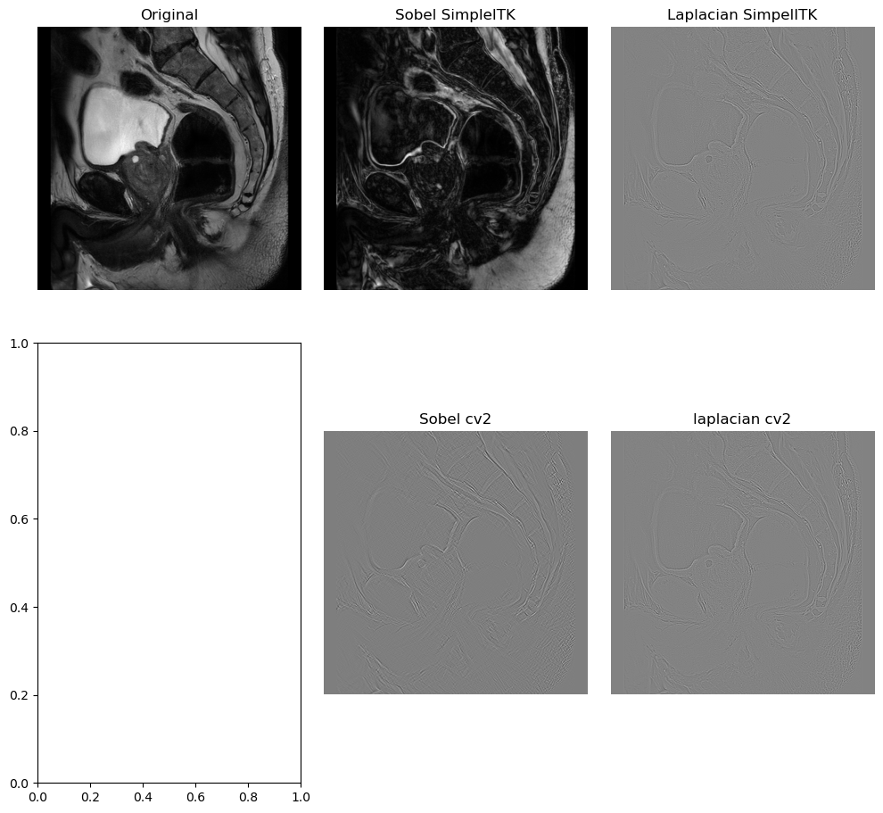

#  SimpleITK Filters and resampling
The objectives of this homework are:
1. Practice image filters.
2. Practice image resampling using SimpleITK
3. Practice use of morphological filters.

All the answer should be submitted in a single jupyter notebook. 

## Image resampling (10 points)
Use SimpleITK to resample `data/sag.mha` into isotropic voxels of size 0.5 'spacing' units. 

Plot the middle slide of all the three planes (axial, coronal, sagittal) in a single figure.

## Image filtering (10 points)

Use Simpleitk and OpenCV to compute the following edge filters: 
1. Sobel
2. Laplacian

Plot the middle saggital slice for the detected edges in a single figure and with the proper labels.  

Explain the differences between the filters and the results. Why?
<!-- Show output.png image -->

## Image morphological filters (10 points)

Use any morphological filters to improve the segmentation of the bladder
provided in `data/sag_seg.png` for the `data/sag.png` image.
To make it easier, I have provided both images
as png. You can read it with any image reader.

The current segmentation is the following:

Describe you approach and show the results in a single figure.

## Extra (10 points)
Assume you are provided with a location inside the bladder for your `sag.mha` image file, lets say `x=100, y=100, z=100`. How can you make a 3D segmentation of the bladder using this information? Describe the steps and provide a code example.